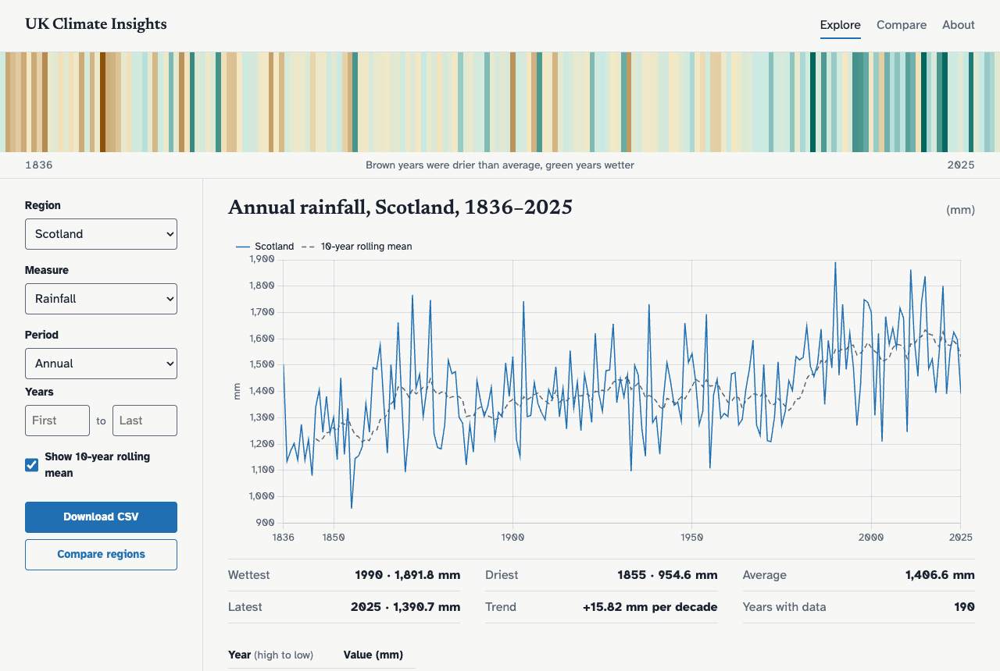
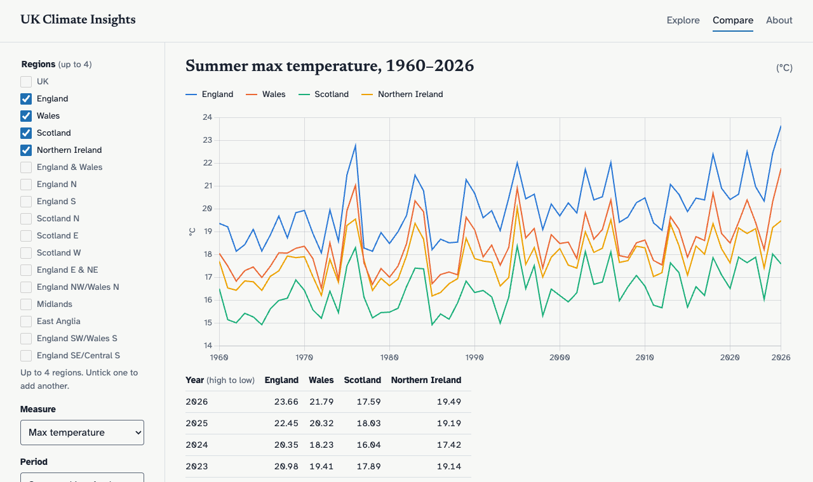
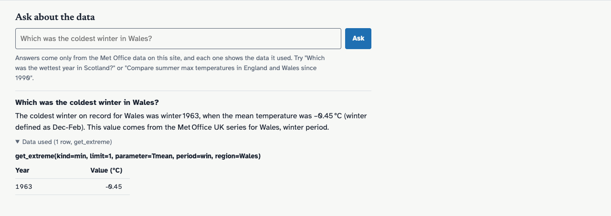
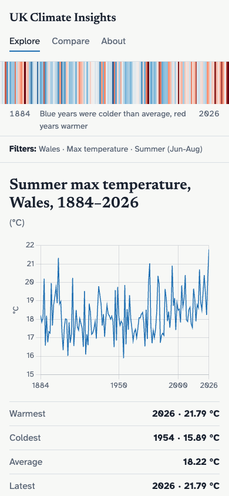

# UK Climate Insights

I built this for the FarmSetu take-home. It loads the Met Office's UK and regional climate series
into Postgres. That's 119 small text files, one per region and measure, and the rainfall records
start in 1836. You can get at the data through a REST API, an explorer page with charts, or a chat
box that answers questions from the same tables. The chat can't invent numbers. The model only gets
six read-only query functions, and every answer lists the calls it made and the rows that came back.
The fiddliest part was the parser. In the current year's rows the Met Office leaves blank space
where months haven't happened yet, so a plain whitespace split moves the winter value into September
without any error. The chat runs on Groq's free tier, which allows about three questions a minute.
The table below maps each evaluation item to the code.

**Live:** https://uk-climate-insights.onrender.com (free tier: the first request after 15 idle
minutes takes about a minute to wake the service)

**API docs:** [/api/docs/](https://uk-climate-insights.onrender.com/api/docs/) ·
**Architecture:** [docs/ARCHITECTURE.md](docs/ARCHITECTURE.md) ·
**Decisions:** [docs/adr/](docs/adr/) · **Tests:** [docs/TESTING.md](docs/TESTING.md)



| Compare regions | Chat, with the data it used | Mobile |
|---|---|---|
|  |  |  |

## Evaluation checklist

| # | Item | Where | Notes |
|---|---|---|---|
| 1 | Project setup | [`config/settings/`](config/settings/), [`pyproject.toml`](pyproject.toml), [`requirements.txt`](requirements.txt), [`.env.example`](.env.example) | Django 5.2 LTS, base/dev/prod settings, all config from env, ruff, pytest, pinned deps |
| 2 | Data parsing | [`climate/parsing.py`](climate/parsing.py), [`climate/fetching.py`](climate/fetching.py), [`climate/ingest.py`](climate/ingest.py) | Column-position parser tested on real files; polite fetching with retries; one transaction per file |
| 3 | Data modelling | [`climate/models.py`](climate/models.py), [`climate/catalog.py`](climate/catalog.py), [`climate/periods.py`](climate/periods.py) | Unique key and valid periods enforced by Postgres; idempotent upsert; provenance on every row |
| 4 | REST API | [`climate/api/`](climate/api/), [`climate/queries.py`](climate/queries.py) | DRF + django-filter, whitelisted params (400 on bad input), pagination, CSV, OpenAPI at `/api/docs/` |
| 5 | Frontend | [`climate/templates/climate/`](climate/templates/climate/), [`climate/static/climate/`](climate/static/climate/) | Explorer (stripes, chart, stats, table), compare, about; shareable URLs; dark mode; mobile |
| 6 | Docker | [`Dockerfile`](Dockerfile), [`docker/entrypoint.sh`](docker/entrypoint.sh), [`docker-compose.yml`](docker-compose.yml) | Multi-stage, non-root, healthcheck; `docker compose up` loads the data on first boot |
| 7 | Cloud deployment | [`render.yaml`](render.yaml), [ADR-004](docs/adr/004-render-web-neon-postgres.md) | Render (Docker web service) + Neon Postgres |
| 8 | LLM chat | [`climate/chat/`](climate/chat/), `POST /api/v1/chat/` | Groq tool calling over validated query functions; answers carry their data; 503 when unavailable |
| + | Git | [pull requests](https://github.com/kumarswamyg2005/uk-climate-insights/pulls?q=is%3Apr) | One branch and PR per step, conventional commits, CI on every PR, tag `v1.0.0` |
| + | Public cloud | see Live above | |
| + | Frontend for access and visualisation | see 5 | |

## Quick start

With Docker (the only requirement):

```bash
git clone https://github.com/kumarswamyg2005/uk-climate-insights.git
cd uk-climate-insights
docker compose up --build
```

The app is up on http://localhost:8000 within seconds. On the first boot it downloads all 119 Met
Office files in the background (about two minutes, 279,208 rows), so charts fill in as the data
lands. Later boots skip the download once an ingest has completed.

- Chat: put `GROQ_API_KEY=...` in a `.env` file next to `docker-compose.yml` (no space after `=`).
  Without it the chat answers 503 and everything else works.
- Admin: set `DJANGO_SUPERUSER_USERNAME`, `DJANGO_SUPERUSER_EMAIL` and `DJANGO_SUPERUSER_PASSWORD`
  in the same `.env` before the first boot, then sign in at http://localhost:8000/admin/.
- Ports in use? `WEB_PORT=8001 DB_PORT=5433 docker compose up --build`.

Without Docker for the app (Postgres still from compose):

```bash
docker compose up -d db
python3.12 -m venv .venv && source .venv/bin/activate
pip install -r requirements-dev.txt
python manage.py migrate
python manage.py ingest_metoffice            # all files; or --regions UK,Wales --parameters Tmax
python manage.py runserver
```

## The data

Each file is `https://www.metoffice.gov.uk/pub/data/weather/uk/climate/datasets/{parameter}/date/{region}.txt`,
the URL the Met Office's own download form builds. There are 17 regions and 7 measures:

| Measure | Code | Unit | From | Seasons and year |
|---|---|---|---|---|
| Max, min, mean temperature | `Tmax`, `Tmin`, `Tmean` | °C | 1884 | day-weighted mean of the months |
| Sunshine | `Sunshine` | hours | 1910 | total |
| Rainfall | `Rainfall` | mm | 1836 | total |
| Days with ≥1 mm rain | `Raindays1mm` | days | 1891 | total |
| Days of air frost | `AirFrost` | days | 1931 | total |

Things the parser and the UI deal with (all covered by tests on real files):

- **Fixed-width layout.** Each value sits right-aligned under its header, so the parser matches
  values to columns by right edge instead of splitting on whitespace.
- **The current year is partial**, with blank cells, not markers. Missing cells produce no row.
- **`---`** appears once per file, in the first year's winter column, because the previous December
  isn't in the record. It is never stored as zero. A real `0.0` (a July with no frost) is kept.
- **Winter spans two years.** `win` for 2026 is December 2025 plus January and February 2026, as
  labelled in the files. I checked this against the monthly values for every year.
- `-0.0` appears in the files and is stored as `0.0`.

## API

Everything is under `/api/v1/`, read-only except the chat. It's anonymous, and bad parameters
return 400 with the valid values listed.

| Endpoint | Returns |
|---|---|
| `GET regions/`, `GET parameters/` | codes and names; parameters include unit and the years held |
| `GET observations/?region=&parameter=&period=&year_from=&year_to=&ordering=&page=&page_size=` | paginated rows, each with unit and provenance |
| `GET series/?region=&parameter=&period=[&year_from=&year_to=]` | `{unit, points: [[year, value], ...]}` for charts |
| `GET series.csv?...` | the same series as a CSV download |
| `GET summary/?...` | count, mean, min and max with every tied year, latest, trend per decade |
| `GET extremes/?...&kind=max\|min&limit=` | ranked years, what the chat uses for "wettest" or "coldest" |
| `GET compare/?regions=a,b,c&parameter=&period=` | up to 4 regions aligned by year, `null` for gaps |
| `GET ingestion-runs/latest/` | when the data was last refreshed |
| `POST chat/` | `{answer, model, tool_calls, data}` |
| `GET /healthz` | liveness plus a database round-trip |

```bash
BASE=https://uk-climate-insights.onrender.com   # or http://localhost:8000

curl "$BASE/api/v1/summary/?region=Scotland&parameter=Rainfall&period=ann"
curl "$BASE/api/v1/extremes/?region=Wales&parameter=Tmean&period=win&kind=min&limit=3"
curl "$BASE/api/v1/compare/?regions=England,Wales&parameter=Tmax&period=sum&year_from=1990"
curl -o scotland.csv "$BASE/api/v1/series.csv?region=Scotland&parameter=Rainfall&period=ann"
curl "$BASE/api/v1/series/?region=Atlantis&parameter=Tmax&period=ann"      # 400, lists valid regions

curl -X POST "$BASE/api/v1/chat/" -H "Content-Type: application/json" \
     -d '{"message": "Which was the wettest year in Scotland?"}'
```

## Chat

Try:

- Which was the wettest year in Scotland?
- Which was the coldest winter in Wales?
- Compare summer max temperatures in England and Wales since 1990.
- How many frost days did East Anglia have in January 1963?
- Has spring got sunnier in the UK?
- What will the weather be tomorrow? (it says it can't answer that)

How it stays grounded ([ADR-003](docs/adr/003-llm-tool-calling-vs-text-to-sql.md)):

1. The model gets six tools (`list_regions`, `list_parameters`, `get_series`, `get_extreme`,
   `get_summary`, `compare_regions`) and no SQL.
2. Tool arguments go through the same validators as the REST API before any query runs.
3. The system prompt lists the real codes and year ranges and forbids answers from memory.
4. In code, an answer that contains numbers but made no successful tool call is replaced with a
   refusal.
5. The response includes every call and the rows it returned, shown in the UI under "Data used".

The default model is `openai/gpt-oss-120b`. I checked it with a real tool-calling request at build
time; `llama-3.3-70b-versatile` wasn't available to this account. If the model is rate-limited, the
request retries once on `openai/gpt-oss-20b`.

## Tests

```bash
docker compose up -d db
pytest --cov            # 208 tests, 99% line + branch coverage of climate/, gate at 85%
ruff check . && ruff format --check .
```

Tests run against real Postgres. The parser tests use five real Met Office files from
[`tests/fixtures/`](tests/fixtures/). HTTP is mocked with `responses`, and the LLM with a fake
client, so nothing touches the network. [docs/TESTING.md](docs/TESTING.md) maps every rule in
[`climate/invariants.py`](climate/invariants.py) to the tests that cover it. CI runs lint, a
migrations check, a production `collectstatic`, the tests and a Docker build on every PR.

## Design decisions

| Decision | Instead of | Why | Record |
|---|---|---|---|
| Django templates + vanilla JS on our own API | React SPA | one deployable, no build step, the UI exercises the public API | [ADR-001](docs/adr/001-django-templates-vs-spa.md) |
| Upsert + prune per file in one transaction | delete and reload | idempotent, never an empty series, provisional months update in place | [ADR-002](docs/adr/002-postgres-upsert-strategy.md) |
| LLM tool calling | text-to-SQL | the model can only do what the API already allows | [ADR-003](docs/adr/003-llm-tool-calling-vs-text-to-sql.md) |
| Render web + Neon Postgres | Render Postgres, EC2 | free, HTTPS, and a database that doesn't expire after 30 days | [ADR-004](docs/adr/004-render-web-neon-postgres.md) |
| Pure-Python parser | pandas | the format needs column positions, not a dataframe; every line is explainable | [docs/WALKTHROUGH.md](docs/WALKTHROUGH.md) |

## Assumptions

- Only the year-ordered (`date/`) files are used; the ranked files hold the same values.
- Codes are the Met Office's; display names follow the labels on the Met Office page.
- The trend is a least-squares straight line over the selected years, per decade.
- Any run of dashes in a cell means missing. Any other non-numeric value fails that file loudly
  rather than being skipped.
- Two small additions beyond the brief: `GET /extremes/` (so every chat tool has an API
  equivalent), and `IngestionRun.source_updated_at` (the Met Office "Last updated" stamp, shown in
  the footer).
- Static files are collected when the image is built, not at boot, which keeps the image immutable
  and cold starts short.

## Known limitations and next steps

- **The admin ingest runs in a background thread** and dies if the worker restarts. A job runner
  would make it durable.
- **Free tiers:** the web service sleeps after 15 idle minutes (about a minute to wake), Neon
  suspends compute when idle, and Groq's free quota is about three chat questions a minute
  (after that the chat answers 503 "busy").
- The chat rate limit uses in-process memory. That's exact with the single gunicorn process used
  here, but it needs Redis before scaling out.
- `/parameters/` scans all observations for year ranges (about 85 ms). An index on
  `(parameter, year)` fixes it if it matters.
- Swagger UI loads its assets from a CDN (the drf-spectacular default). Charts and fonts are
  vendored.
- The chart JavaScript is checked in a real browser, not by unit tests.
- Only the latest value is kept; revisions overwrite. A history table would keep them.

## Operations

- **Monthly refresh:** [`.github/workflows/ingest.yml`](.github/workflows/ingest.yml) runs the
  ingest against the production database at 06:17 UTC on the 2nd of each month (the Met Office
  updates on the 1st). Anything short of 119/119 files fails the job, and GitHub emails the owner.
  It needs one repository secret, `DATABASE_URL` (the Neon connection string).
- **Re-ingest now:** GitHub → Actions → **Monthly Met Office ingest** → **Run workflow**; or
  `/admin/climate/ingestionrun/` → **Run ingest now**; or `python manage.py ingest_metoffice`.
  Re-running is always safe.
- **Rotate the Groq key:** create a new key at console.groq.com and replace `GROQ_API_KEY` in
  Render → Environment (the service redeploys). Then delete the old key.
- **Deploy:** push to `main`. Render rebuilds the Docker image from `render.yaml`.

## Attribution

Contains Met Office data © Crown copyright 2026, licensed under the
[Open Government Licence v3.0](https://www.nationalarchives.gov.uk/doc/open-government-licence/version/3/).
Source: [Met Office UK and regional series](https://www.metoffice.gov.uk/research/climate/maps-and-data/uk-and-regional-series).
This project is independent and not endorsed by the Met Office. Chart.js (MIT) is vendored; the
Newsreader and Atkinson Hyperlegible fonts (SIL OFL) are self-hosted.
