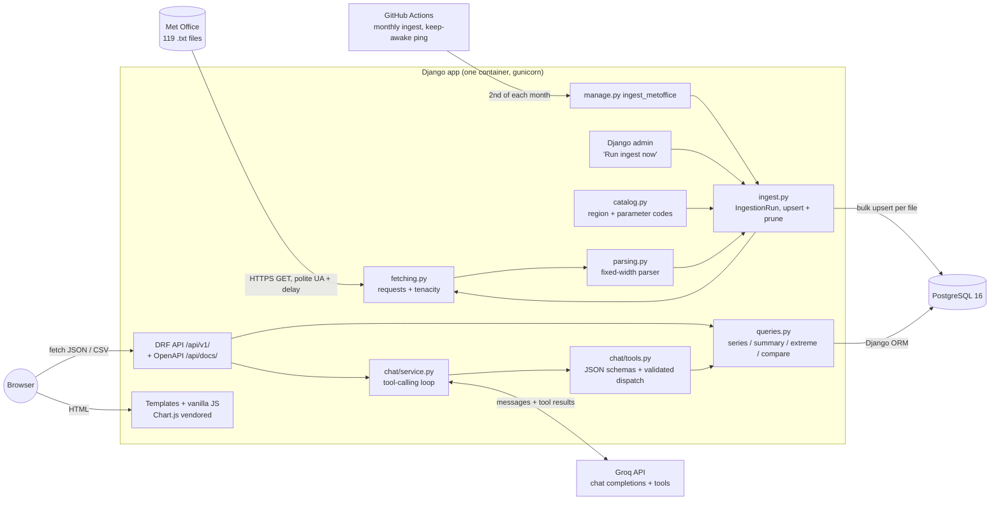
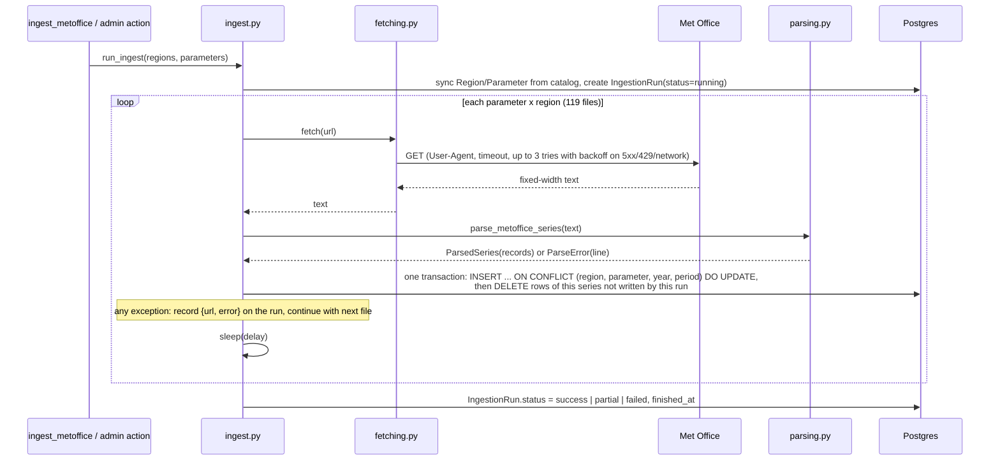
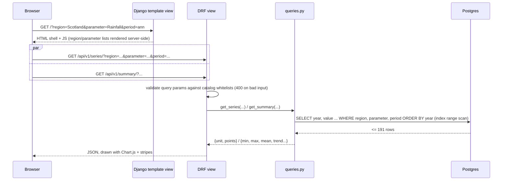
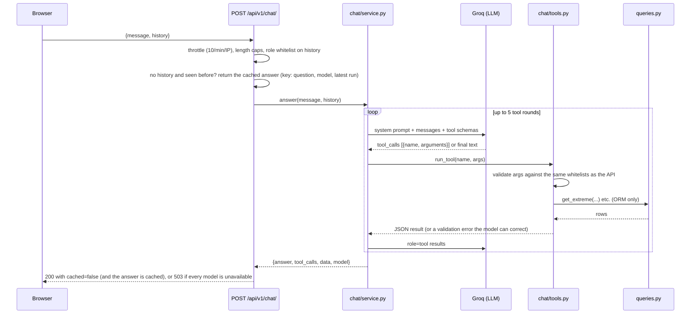
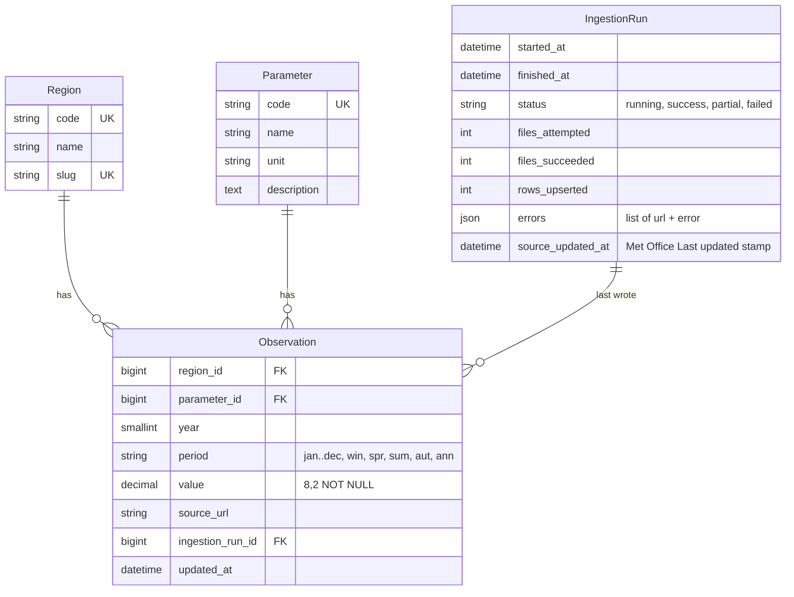
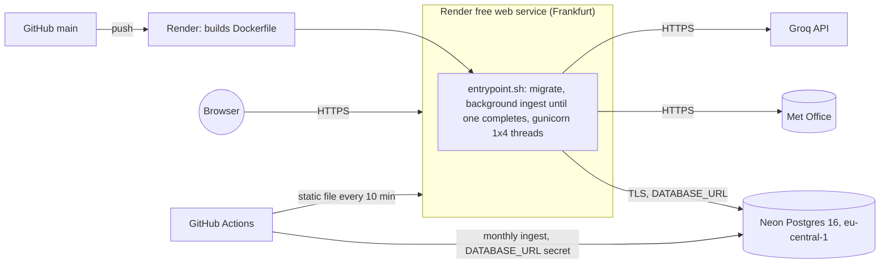

# Architecture

UK Climate Insights ingests the Met Office "UK and regional series" into Postgres and serves the data
three ways: a REST API, a server-rendered explorer UI that calls that API, and a chat endpoint where an
LLM answers questions by calling typed query functions (never SQL).

## 1. Requirements

**Functional**

- Fetch the 119 year-ordered files (17 regions x 7 parameters) from
  `https://www.metoffice.gov.uk/pub/data/weather/uk/climate/datasets/{parameter}/date/{region}.txt`.
- Parse them into `(region, parameter, year, period, value)` observations, where period is one of
  12 months, 4 seasons or the annual value.
- Store them so a re-run updates provisional values instead of duplicating them.
- Serve filtered observations, chart-ready series, summary statistics, multi-region comparison and CSV
  over a read-only REST API with OpenAPI docs.
- Show charts, warming stripes, stats and a table in a browser, with shareable URLs.
- Answer natural-language questions from the database, showing the tool calls and rows used.
- Let an admin see ingestion runs and trigger a re-ingest.

**Non-functional**

| Concern | Target | Why it is realistic |
|---|---|---|
| Data volume | ~279k rows, grows by ~2k rows/month | 119 files x ~2.3k cells |
| Freshness | Monthly (Met Office updates at the start of each month) | "Last updated 01-Sep-2026" in every file |
| Read latency | < 100 ms p95 for series/summary | each query touches <= 191 rows via an index |
| Availability | Best effort, single instance | public demo on a free tier |
| Cost | Free tier | Render web service + managed Postgres |
| Security | Read-only public API, no secrets in repo, LLM can't touch SQL | see invariants in `climate/invariants.py` |

**Constraints:** one developer, 3-4 days, Django required, must be explainable line by line in an
interview. This rules out a SPA build pipeline, a task queue and pandas.

## 2. Components

`catalog.py` is the single source of truth for region and parameter codes. The ingest mirrors it into
the `Region` and `Parameter` tables, and every whitelist (API filters, query validation, the LLM's
system prompt and tool schemas) is built from it.

`queries.py` holds the read logic once. The REST views and the LLM tools are two thin front ends over
the same functions, so the chat can never answer from a code path the API doesn't also expose.

## 3. Data flow

### Ingest (monthly, or on demand)

### Read (explorer)

### Chat

## 4. Data model

- **Unique constraint** `(region, parameter, year, period)` is enforced by Postgres, and it is the
  conflict target for the upsert. A duplicate can't get in even if application code is wrong.
- **Second index** `(region, parameter, period, year)`: every read filters on region, parameter
  and period, and orders by year. The unique index has `year` before `period`, so it can't serve
  that access pattern as a single range scan.
- **Missing values are absent rows**, never zero or NULL. `value` is `NOT NULL`, so "no data" has
  exactly one representation.
- **`Decimal(8, 2)`**: source values have 1-2 decimals and a maximum of 2280.2, so there are no
  float rounding surprises.
- **Provenance**: `source_url` and `ingestion_run` are overwritten on every upsert, so each row
  points at the run and file that last confirmed it.
- **Winter** (`win`) is stored under the year of its January. `2026 win` = Dec 2025 + Jan-Feb 2026,
  exactly as the source files label it.

## 5. API surface

All under `/api/v1/`, GET-only except `POST /chat/`. Full contract at `/api/docs/` (drf-spectacular).

| Route | Returns |
|---|---|
| `regions/`, `parameters/` | lookup lists; parameters include unit and available year range |
| `observations/` | paginated, filterable rows (django-filter) |
| `series/`, `series.csv` | chart payload / CSV for one region x parameter x period |
| `summary/` | min, max (with every tied year), mean, latest, count, linear trend per decade |
| `extremes/` | ranked highest or lowest years (the chat's `get_extreme`, exposed for reproducibility) |
| `compare/` | up to 4 regions aligned on a shared year axis |
| `chat/` | grounded LLM answer with the tool calls and data used |
| `ingestion-runs/latest/` | last run that stored data, with the Met Office "Last updated" stamp |

Bad query parameters return 400 with the valid values listed. An empty result is 200 with an empty
list, never 404.

## 6. Reliability and error handling

| Failure | Behaviour |
|---|---|
| Met Office 5xx / 429 / network error | retry 3x with exponential backoff, then record the error on the run and continue |
| Met Office 404 | not retried; recorded; run ends `partial` |
| File format change | `ParseError` with line number; that file is skipped and existing rows stay untouched |
| DB error mid-file | the per-file transaction rolls back; other files are unaffected |
| Groq 429 on one model | the request moves to the next model in a three-model chain, each with its own quota |
| Groq missing key / all models busy / timeout | `POST /chat/` returns 503; cached answers still work; the rest of the app is unaffected |
| Monthly ingest short of 119/119 files | the scheduled GitHub job fails and GitHub emails the owner; existing data stays |
| DB down | `/healthz` returns 503 so the platform restarts or alerts |

## 7. Deployment

The image is built once per push, with static files collected at build time and served by
WhiteNoise with immutable caching. Configuration comes only from environment variables in
production. Secrets (`SECRET_KEY`, `DATABASE_URL`, `GROQ_API_KEY`) live in Render's environment,
never in the repo. See [ADR-004](adr/004-render-web-neon-postgres.md) for why the database is on
Neon.

Two scheduled GitHub Actions workflows complete the picture. `ingest.yml` runs the ingest against
Neon on the 2nd of each month and fails loudly on anything short of 119/119 files. `keep-warm.yml`
requests a static file every 10 minutes, so the free Render service doesn't sleep; it skips the
database, so Neon can still suspend.

## 8. Load estimate

- Storage is about 180 B/row x 279k, so ~50 MB of heap plus two B-tree indexes. That's well under
  1 GB for decades.
- A series or summary read touches at most 191 rows through an index. A compare reads at most 4 x 191.
- Ingest makes 119 HTTP requests (~2.3 MB) and 119 upsert transactions. It finishes in about 2 minutes
  with a 0.5 s politeness delay, and the delay dominates.
- The chat costs 1-6 LLM calls per question, capped by 5 tool rounds and throttled at 10/min/IP.

A single small instance is enough. The bottleneck is the LLM provider's rate limit, not Django or
Postgres.

## 9. Trade-offs

| Decision | Chosen | Rejected | Why |
|---|---|---|---|
| UI | Django templates + vanilla JS on our own API | React SPA | one deployable, no build step; the UI still exercises the public API ([ADR 001](adr/001-django-templates-vs-spa.md)) |
| Writes | upsert + prune in one transaction per file | delete-and-reload | no window where a series is empty; idempotent; provisional months update in place ([ADR 002](adr/002-postgres-upsert-strategy.md)) |
| Chat | tool calling over validated ORM functions | text-to-SQL | the model can't read or write anything the API can't; args are whitelisted ([ADR 003](adr/003-llm-tool-calling-vs-text-to-sql.md)) |
| Parser | pure Python, column-position based | pandas `read_fwf` / whitespace split | the partial current year has blank cells; a whitespace split silently shifts values into the wrong month |
| Ingest trigger | management command + admin action (background thread) | Celery + beat | data changes monthly; a queue adds two services for one job a month |
| LLM model | `openai/gpt-oss-120b` on Groq, then `openai/gpt-oss-20b`, then `qwen/qwen3.8-27b` | `llama-3.3-70b-versatile` | verified with live tool-calling requests; the Llama model returned 404 for this account; each fallback has its own free-tier quota, and repeated questions come from a cache |
| Hosting | Render web + Neon Postgres | Render Postgres, EC2 | free Render Postgres is deleted 30 + 14 days after creation ([ADR-004](adr/004-render-web-neon-postgres.md)) |

## 10. What I'd revisit as it grows

- **Caching the read API**: responses only change after an ingest, so HTTP `Cache-Control` / ETag
  keyed on the last run id, or a per-view cache invalidated by the ingest. (Chat answers are
  already cached this way.)
- **Background work**: move the admin-triggered ingest from a thread to a proper job runner so it
  survives worker restarts.
- **More sources**: HadUK-Grid gridded data or station data would need a `Source` dimension on
  `Observation`.
- **Chat cost control**: per-day quotas, a shared cache (Redis) across processes, and Groq's paid
  tier once traffic is real.
